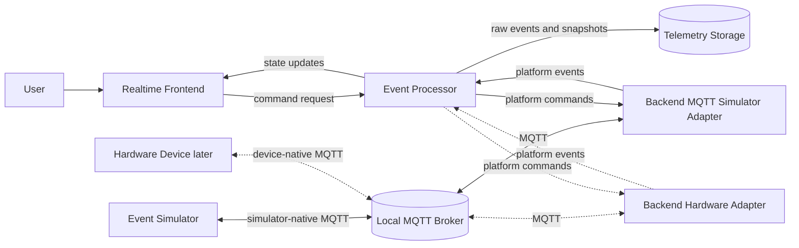
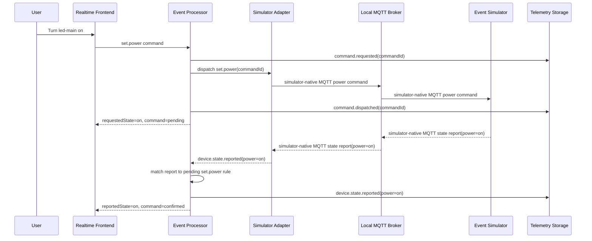
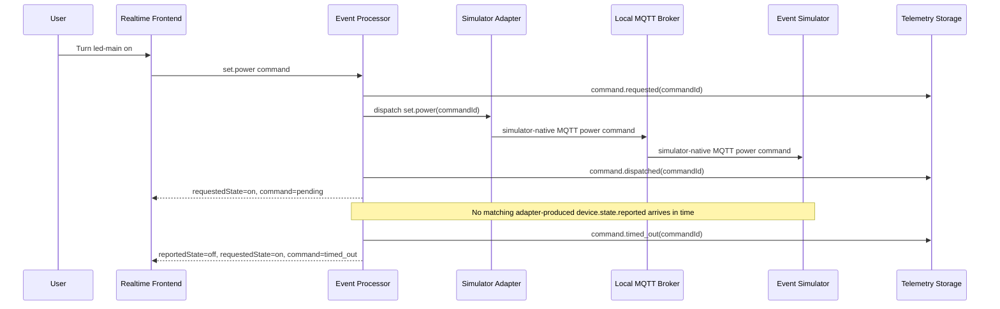
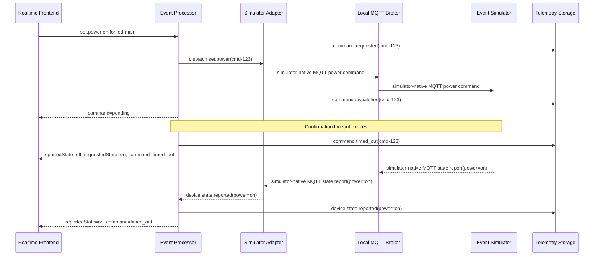
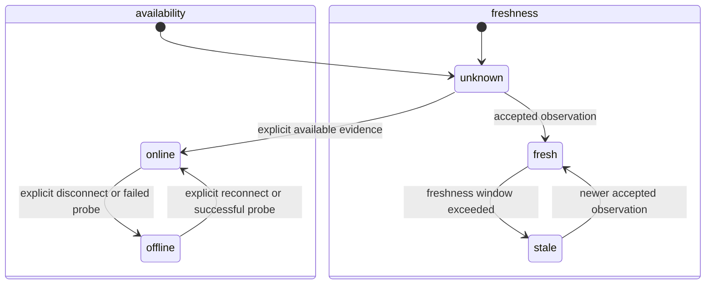
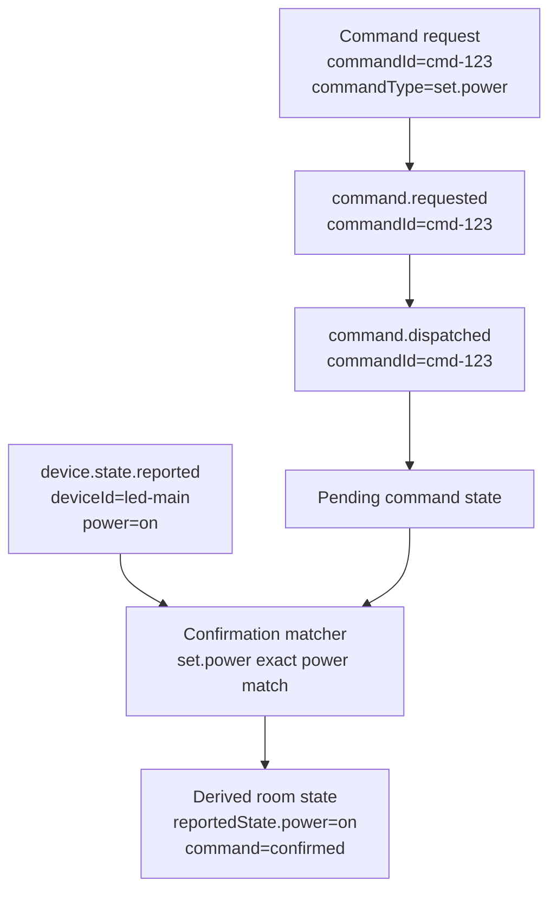
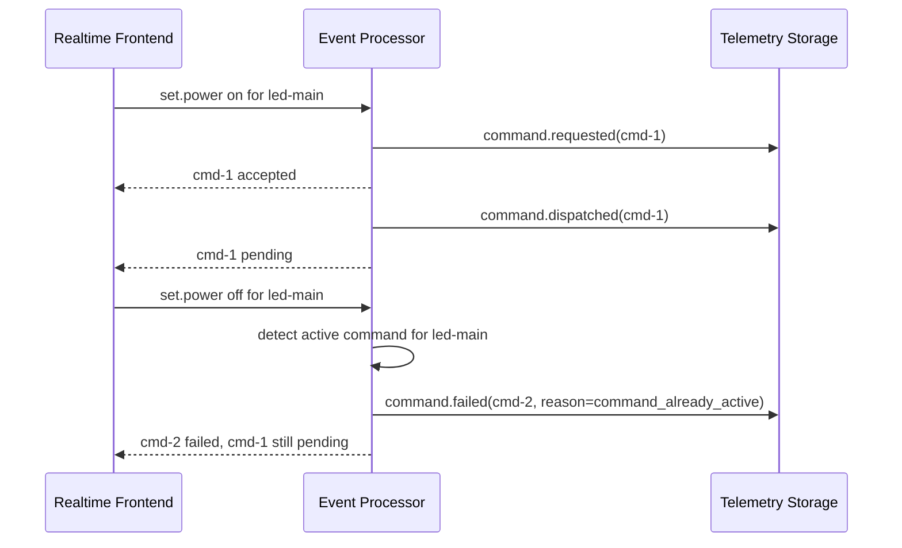
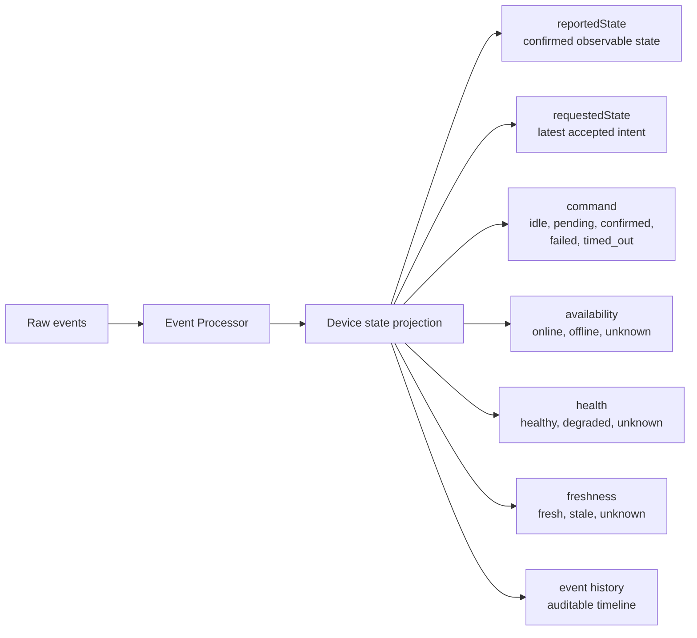
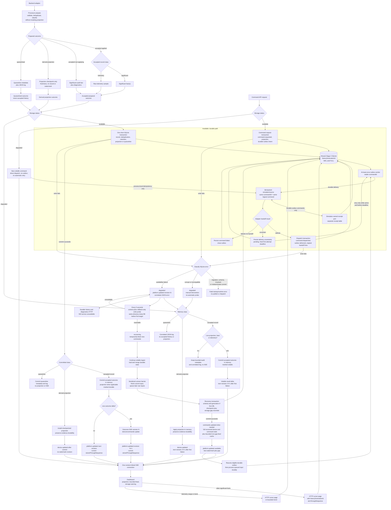

# Architecture Examples

These examples turn the architecture decisions into concrete flows. They are
not implementation diagrams and do not describe the repository's current
runtime state. They show target behavior for backend-backed slices as the system
grows beyond the smallest read path.

## Local-First System Slice

After Stage 5, the simulator behaves like a real device source through the
local MQTT broker. It emits simulator-native MQTT messages, consumes
simulator-native MQTT commands and exercises failure modes before hardware is
introduced.

## Successful Command Confirmation

The UI may show the requested state as pending, but it must not present it as
confirmed until the processor receives matching device evidence.

## Timeout Before Confirmation

A timeout closes the active command lifecycle, but it does not rewrite the
reported device state. The history should still explain what the user asked for
and when the request stopped waiting for confirmation.

## Late Confirmation After Timeout

The late device report updates `reportedState` because it is a real observation.
It does not reopen or convert the timed-out command into a confirmed command.

## Availability, Freshness and Recovery

Availability changes only from availability evidence. A later accepted
observation independently restores freshness. The UI may therefore show an
online device with stale data, or an offline device while retaining its last
known observation and command history.

## Command Correlation

Command lifecycle events carry `commandId`. Device state reports remain observed
facts and confirm a command only through the configured matcher for that command
type.

## Overlapping Command Rejection

The first implementation allows only one active command (`accepted` or
`pending`) per device. Rejecting
overlapping commands keeps confirmation unambiguous and gives the UI a clear
failure to show.

## Device State Projection

The frontend reads the projection, not raw intent. This keeps the visible room
state aligned with the reliability rules: availability and stale data are
separate, pending state is visible, failures are first-class and confirmed state
is never faked from a request.

## Stage 4 Storage, History and Realtime Delivery

This target Stage 4 flow is not the current runtime. In the durable path, SSE is
published only after SQLite commit. If that commit fails, the already prepared
input is applied in memory as volatile after `platform.updated(degraded)`. Only
availability failures enable automatic probes; corruption requires manual
intervention, while migration, schema and programming defects are fatal.

Recovery does not backfill outage observations. Its serialized cutover
checkpoints every volatile outcome through one boundary, queues later inputs,
commits the gap and publishes it through `platform.updated(available)`. Later
queued inputs then enter the ordinary durable path. Filling the 1,000-input
cutover queue aborts that recovery attempt and drains the queue as volatile
instead of dropping input.

If the recovered projection differs from what an already connected client saw
while degraded, one full `commands.updated` reconciliation revision precedes
the available/gap platform revision. A new connection reads only the atomically
installed final snapshot.

One input may add multiple related feed records to the same revision, while raw
telemetry may add one sample for an open details view. HTTP returns durable
history through a pinned history generation and storage watermark. The client buffers every SSE
addition, merges by stable `recordId`, and reconnects from a new snapshot rather
than SSE replay. The pinned HTTP session is complete through its watermark;
retention tombstones preserve it for the cursor's fixed five-minute lifetime,
and non-feed facts committed later require an explicit refetch. A new history
generation rejects old cursors and resets the old pages and overlay instead of
merging reset sequences. Outbox retry is safe
only because the receiving source treats a stable `commandId` as one logical
command across source restart through its source-owned durable receipt, and
uncertain-delivery retry stops at the original deadline or any earlier terminal
lifecycle. In Stage 4 that source-owned port uses a separate table in the shared
SQLite database; future out-of-process sources own equivalent persistence on
their side of the transport. Volatile commands bypass durable receipts and are
never retried.
