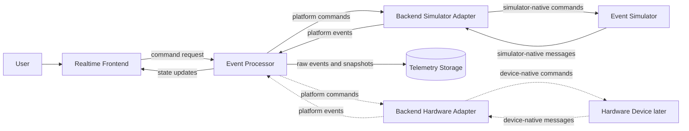
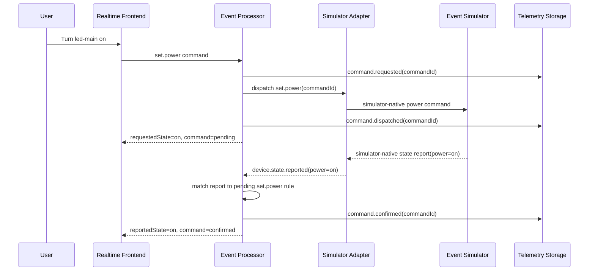
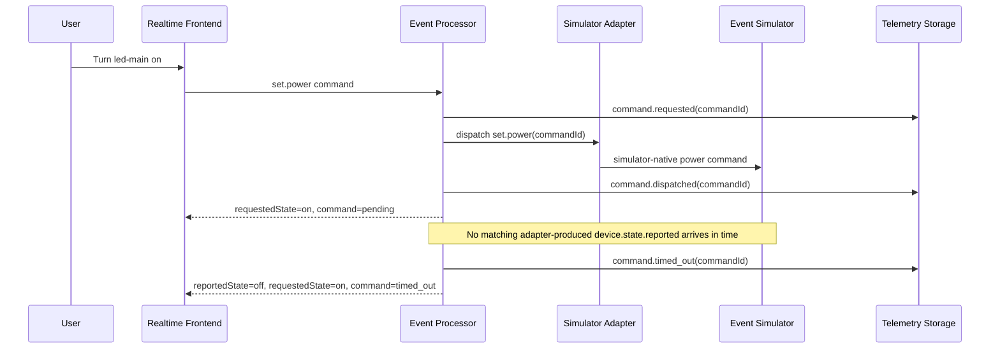
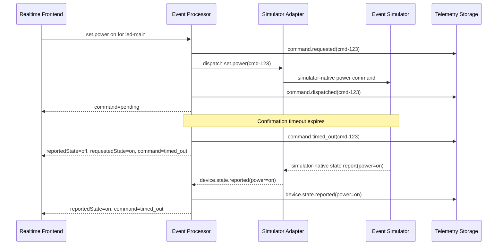
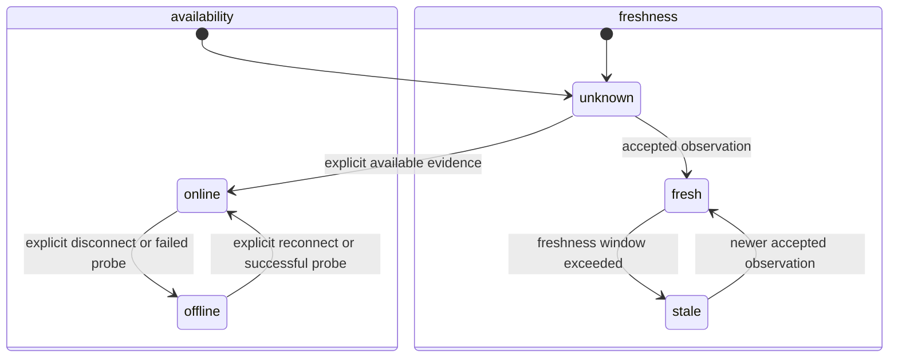
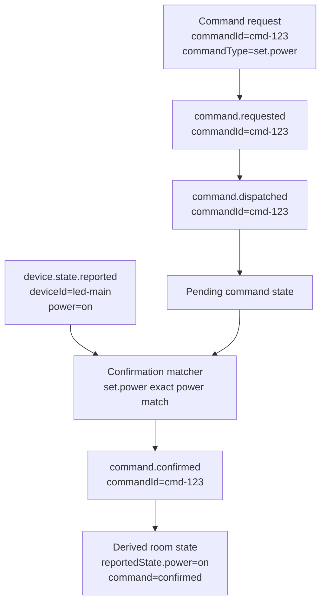
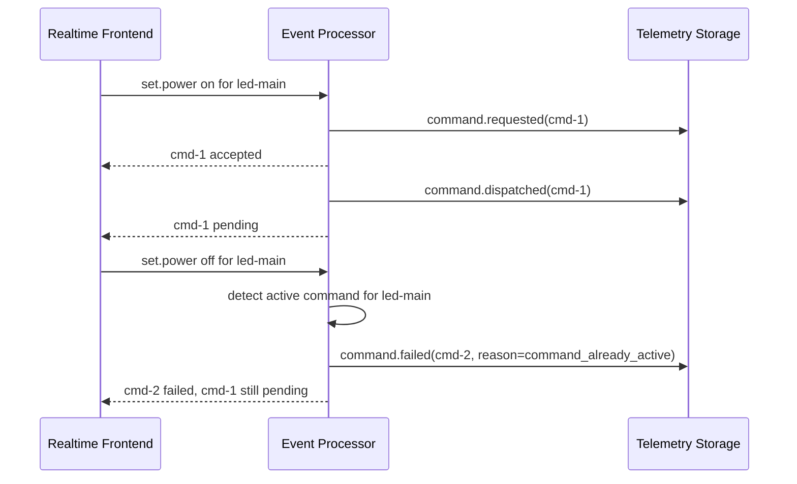
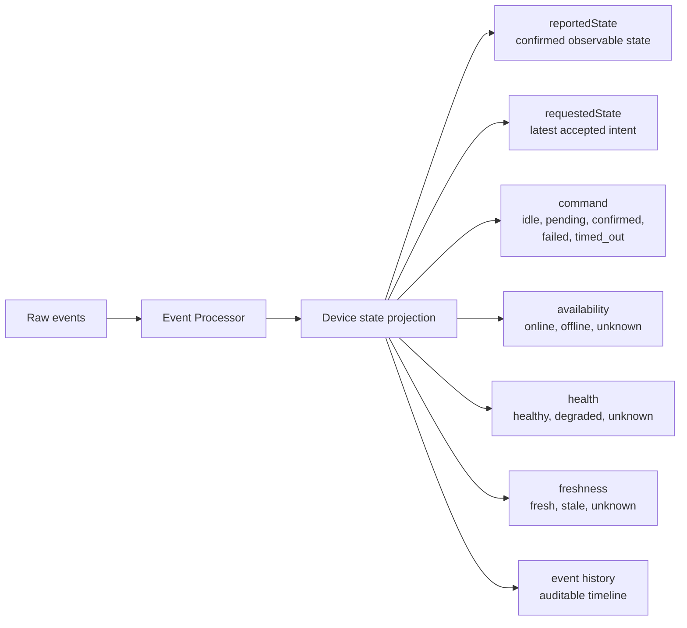

# Architecture Examples

These examples turn the architecture decisions into concrete flows. They are
not implementation diagrams and do not describe the repository's current
runtime state. They show target behavior for backend-backed slices as the system
grows beyond the smallest read path.

## Local-First System Slice

This is the first useful backend-backed vertical slice. The simulator behaves
like a real device source behind a backend adapter: it emits simulator-native
messages, consumes simulator-native commands and exercises failure modes before
hardware is introduced.

## Successful Command Confirmation

The UI may show the requested state as pending, but it must not present it as
confirmed until the processor receives matching device evidence.

## Timeout Before Confirmation

A timeout closes the active command lifecycle, but it does not rewrite the
reported device state. The history should still explain what the user asked for
and when the request stopped waiting for confirmation.

## Late Confirmation After Timeout

The late device report updates `reportedState` because it is a real observation.
It does not reopen or convert the timed-out command into a confirmed command.

## Availability, Freshness and Recovery

Availability changes only from availability evidence. A later accepted
observation independently restores freshness. The UI may therefore show an
online device with stale data, or an offline device while retaining its last
known observation and command history.

## Command Correlation

Command lifecycle events carry `commandId`. Device state reports remain observed
facts and confirm a command only through the configured matcher for that command
type.

## Overlapping Command Rejection

The first implementation allows only one active command (`accepted` or
`pending`) per device. Rejecting
overlapping commands keeps confirmation unambiguous and gives the UI a clear
failure to show.

## Device State Projection

The frontend reads the projection, not raw intent. This keeps the visible room
state aligned with the reliability rules: availability and stale data are
separate, pending state is visible, failures are first-class and confirmed state
is never faked from a request.
