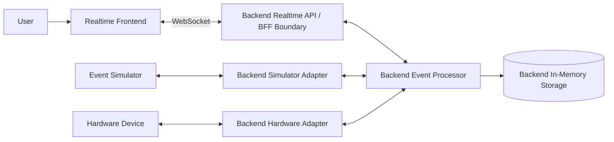

# System Context

The simulator is the first device source. The backend simulator adapter turns
simulator-native messages into platform events and platform commands into
simulator-native commands. A hardware adapter can be added later without
changing the frontend's mental model: simulator and hardware sources are both
handled behind backend-owned adapters.

For Stage 1, the realtime API, event processor and in-memory storage belong to
the local backend. The simulator remains a separate project responsible for
simulated devices and scenarios. The simulator adapter belongs to the backend.
The diagram shows responsibility boundaries, not required production deployment
boundaries.
