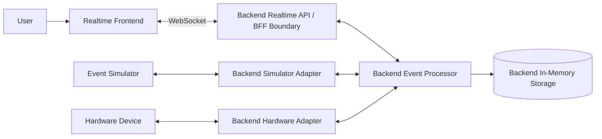

# System Context

The current Stage 1 implementation slice runs only in the frontend: one
simulated temperature sensor updates a read-only UI locally. The broader system
context below is the target shape for later slices after the first realtime read
path is working.

In the broader target model, the simulator is the first external device source.
The backend simulator adapter turns simulator-native messages into platform
events and platform commands into simulator-native commands. A hardware adapter
can be added later without changing the frontend's mental model: simulator and
hardware sources are both handled behind backend-owned adapters.

When backend and simulator slices are introduced, the realtime API, event
processor and in-memory storage belong to the local backend. The simulator
remains a separate project responsible for simulated devices and scenarios. The
simulator adapter belongs to the backend. The diagram shows responsibility
boundaries, not required production deployment boundaries.
