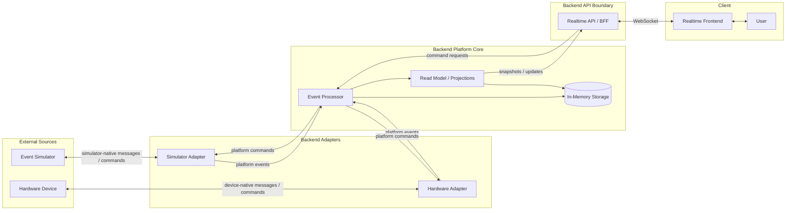

# System Context

The system context below describes the target backend-backed shape of the Smart
Room platform.

In the broader target model, the simulator is the first external device source.
The backend simulator adapter turns simulator-native messages into platform
events and platform commands into simulator-native commands. A hardware adapter
can be added later without changing the frontend's mental model: simulator and
hardware sources are both handled behind backend-owned adapters.

The event processor owns validation, deduplication and command lifecycle rules.
It accepts, ignores or routes events to quarantine according to the platform
event contract and available storage capabilities. Accepted events update the
backend read model/projections: materialized views of current device state,
active command state and recent event history. The realtime API/BFF reads those
projections and streams UI-oriented snapshots or updates to the frontend; it
does not reinterpret raw device-native messages.

The realtime API/BFF also accepts command requests from the UI. Backend platform
code records and interprets command lifecycle facts, while adapters translate
platform commands into simulator-native, hardware-native or external-system
commands.

When backend and simulator slices are introduced, the realtime API, event
processor, read model/projections and in-memory storage belong to the local
backend. The simulator remains a separate project responsible for simulated
devices and scenarios. The simulator adapter belongs to the backend. The diagram
shows responsibility boundaries, not required production deployment boundaries.

## Current Implementation Status

The current repository implementation does not yet include the full target
context. The backend slice currently covers the simulator temperature telemetry
path through adapter, event processor, read-model projection and a small HTTP
snapshot BFF.

The current BFF exposes `GET /room` for the latest `RoomSnapshotProjection`.
It is a snapshot boundary for the frontend, not the final realtime transport.
WebSocket/realtime streaming, command handling, persistence, quarantine storage
and stale/offline derivation are still future slices.
