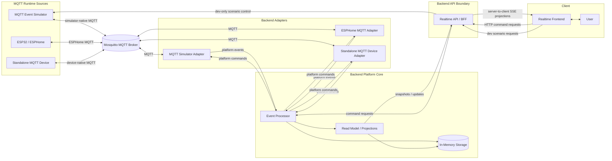
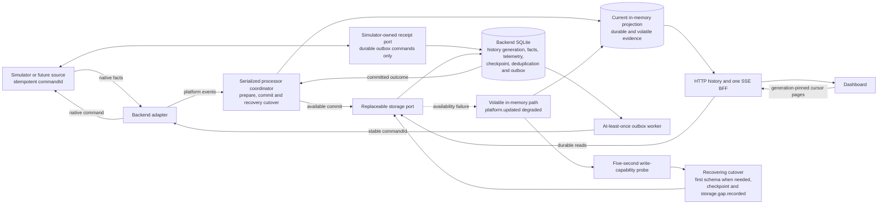

# System Context

The first context diagram describes the pre-persistence backend-backed shape of
the Smart Room platform, including later MQTT sources. Its in-memory storage is
the current architectural baseline, not the accepted Stage 4 storage target.

## Pre-Stage 4 Logical Context

## Stage 4 Storage Context

This diagram is the accepted Stage 4 target. It adds SQLite without making it
the source of current device truth:
the in-memory projection continues during availability failures and declares
volatile evidence explicitly. Automatic outbox retry requires source-owned
idempotency for the stable `commandId`, backed by a durable source receipt that
survives restart of the simulator or later source. Stage 4 injects a
simulator-owned receipt port whose in-process implementation uses a logically
separate table through the shared SQLite connection owner. A receipt failure
maps to definite no-handoff only when non-acceptance is known; inability to
inspect a possible prior acceptance remains uncertain, while an indeterminate
current commit is fatal. Its SQLite error follows the platform storage taxonomy.
Volatile commands bypass durable receipts, use only
process-local source idempotency and are never automatically retried. Future
out-of-process sources must persist equivalent receipts on their side of the
transport.

Once MQTT is introduced, Mosquitto is between every simulator or device runtime
source and its backend adapter. The MQTT simulator, ESP32/ESPHome and standalone
MQTT devices are allowed to have different native topics and payloads; each
backend-owned adapter translates them to and from the same platform contracts.
The frontend does not depend on a source protocol.

Development scenario requests are a separate dev-only BFF-to-simulator control
boundary. They may bypass MQTT because they configure test behavior rather than
representing a device command. Any observation caused by a scenario still
returns from the simulator through MQTT. Direct calls to adapters or simulator
models are limited to isolated unit-test seams and are not shown as runtime
sources.

The broker is a required transport dependency for MQTT-backed devices. On a
backend-to-broker disconnect, devices available only through that dependency
become `offline` with `broker_unavailable` as the availability reason, and
their commands are blocked. A broker reconnect must be followed by trustworthy
device availability evidence before an adapter restores `online`.

The event processor owns validation, deduplication and command lifecycle rules.
It accepts, ignores or routes events to quarantine according to the platform
event contract and available storage capabilities. Accepted events update the
backend read model/projections: materialized views of current device and active
command state. The realtime API/BFF reads those
projections and streams UI-oriented snapshots or updates to the frontend; it
does not reinterpret raw device-native messages.

The realtime API/BFF accepts command requests from the UI through explicit HTTP
boundaries. Its SSE stream is server-to-client only and delivers
UI-oriented snapshots and updates. Backend platform code records and interprets
command lifecycle facts, while adapters translate platform commands into
simulator-native, hardware-native or external-system commands.

When backend and simulator slices are introduced, the realtime API, event
processor, read model/projections and in-memory storage belong to the local
backend. The simulator remains a separate project responsible for simulated
devices and scenarios. The simulator adapter belongs to the backend. The diagram
shows responsibility boundaries, not required production deployment boundaries.

## Current Implementation Status

The current repository implementation does not yet include the full target
context. The backend slice covers simulator temperature telemetry and the LED
command reference path through adapters, event processing, read-model
projections and a small realtime BFF.

The current BFF exposes `http://localhost:4310/room/realtime` as the frontend
runtime path. The backend sends an initial `room.snapshot` message when the
frontend connects, then streams revision-linked `device.updated` and
`commands.updated` messages after projection changes. The current implementation exposes the availability,
operational-health and freshness projection defined in the device-availability ADR. Event history is
deferred to a dedicated future slice. The backend periodically rereads the
projection, but the target model emits time-derived freshness changes such as
`stale` separately from explicit availability changes. The frontend does not
interpret raw platform events.

The BFF also keeps `GET /room` as a debug/read snapshot endpoint for the latest
`RoomSnapshotProjection`; it is not the frontend runtime fallback. `GET
/diagnostics` exposes recent ignored event-processing outcomes so the
development runtime can explain rejected duplicate or invalid events. The
diagnostics response is bounded in-memory, newest-first and metadata-only; it is
not event history or durable quarantine storage. Command handling and command
projections are implemented for the LED reference slice; persistence and
quarantine storage remain future slices. The accepted Stage 4 storage ADR
defines diagnostics as a technical API and structured-log surface rather than
a required Dashboard feature; it does not change the current runtime until it
is accepted and implemented.

For the Stage 4 target, the same SSE connection keeps its snapshot
baseline and revision-linked deltas. The snapshot contains the bounded recent
event feed and `platform.storage`, which solely owns the durable history
generation and watermark. Existing
projection deltas may include multiple related feed records or one telemetry
sample. `platform.updated` reports `available`, `degraded` or `recovering`
without requiring a device change, carries watermark-only durable progress and
may deliver `storage.gap.recorded`. Older
facts and telemetry are loaded through explicit HTTP reads and merged with every
buffered SSE-delivered addition by `recordId` and a pinned history generation
and watermark. The HTTP session is complete through that bound; non-feed facts committed above it
appear after an explicit refetch. Retired rows remain available to an existing
cursor for its fixed five-minute lifetime. It does not create a second history
stream or replay missed data. The client retains its last known generation
while degraded storage reports `null`; a different later non-null generation in
a snapshot or `platform.updated` resets the old HTTP pages and overlay.

SQLite is a durable history and recovery dependency in that proposed model, not
a prerequisite for current device truth. During a storage outage, projections,
freshness and commands continue in memory as explicitly volatile data; durable
HTTP reads are unavailable and the Dashboard keeps the storage problem visible.
Recovery checkpoints current state and records the missing interval rather than
claiming that outage observations were backfilled. A serialized cutover assigns
every queued input to either the volatile checkpoint or later durable
processing. When the restored projection differs, a full `commands.updated`
reconciliation reaches existing clients before the gap-bearing
`platform.updated(available)`; new clients receive the final snapshot directly.

## Development Scenario Controls

The local development runtime may expose a dev-only HTTP control boundary at
`GET` and `POST /dev/devices/:deviceId/scenarios`. A device-card dev control
loads scenarios lazily for its selected device and delegates a named simulator
scenario action to the backend runtime. It is not a product command API, is not
part of `room.snapshot`, and must not be enabled in production.
It is disabled by default and is enabled only when the backend process receives
`ENABLE_DEV_SCENARIOS=true`. The root `npm run dev` launcher sets this local
development flag deliberately; deployed or ad-hoc backend processes do not
inherit scenario mutation access by default.

The frontend development panel uses this boundary only to request simulator
behavior. The resulting observations still travel through the simulator adapter,
event processor, read model and normal realtime snapshot-plus-delta delivery path.
This preserves the distinction between dev tooling and user-facing room state.

The initial controls pause or resume scheduled telemetry, emit the next native
reading, replay the last native reading, emit a deliberately invalid reading,
and reset the simulator sequence. Reset restarts simulated telemetry and emits
a new first reading; it does not clear the backend's deduplication memory or
diagnostics. Replaying a reading preserves its adapter-created
platform event identity, so it exercises platform-event deduplication. An
invalid reading reaches platform validation and is visible through diagnostics
without changing the room projection.
