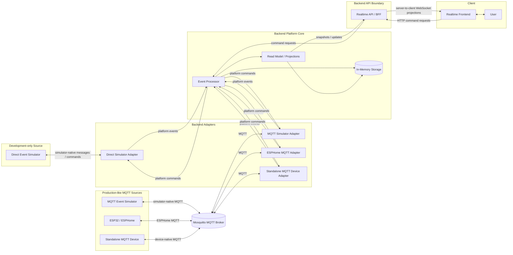

# System Context

The system context below describes the target backend-backed shape of the Smart
Room platform.

In the broader target model, the direct simulator route remains a
development-only source for deterministic tests. The production-like runtime
introduces Mosquitto between sources and their backend adapters. The MQTT
simulator, ESP32/ESPHome and standalone MQTT devices are allowed to have different native topics
and payloads; each backend-owned adapter translates them to and from the same
platform contracts. The frontend does not depend on a source protocol.

The broker is a required transport dependency for MQTT-backed devices. On a
backend-to-broker disconnect, devices available only through that dependency
become `offline` with `broker_unavailable` as the availability reason, and
their commands are blocked. A broker reconnect must be followed by trustworthy
device availability evidence before an adapter restores `online`.

The event processor owns validation, deduplication and command lifecycle rules.
It accepts, ignores or routes events to quarantine according to the platform
event contract and available storage capabilities. Accepted events update the
backend read model/projections: materialized views of current device and active
command state. The realtime API/BFF reads those
projections and streams UI-oriented snapshots or updates to the frontend; it
does not reinterpret raw device-native messages.

The realtime API/BFF accepts command requests from the UI through explicit HTTP
boundaries. Its WebSocket stream is server-to-client only and delivers
UI-oriented snapshots and updates. Backend platform code records and interprets
command lifecycle facts, while adapters translate platform commands into
simulator-native, hardware-native or external-system commands.

When backend and simulator slices are introduced, the realtime API, event
processor, read model/projections and in-memory storage belong to the local
backend. The simulator remains a separate project responsible for simulated
devices and scenarios. The simulator adapter belongs to the backend. The diagram
shows responsibility boundaries, not required production deployment boundaries.

## Current Implementation Status

The current repository implementation does not yet include the full target
context. The backend slice currently covers the simulator temperature telemetry
path through adapter, event processor, read-model projection and a small
realtime BFF.

The current BFF exposes `ws://localhost:4310/room/realtime` as the frontend
runtime path. The backend sends an initial `room.snapshot` message when the
frontend connects, then streams revision-linked `device.updated` messages after
projection changes. The current implementation exposes the availability,
operational-health and freshness projection defined in the device-availability ADR. Event history is
deferred to a dedicated future slice. The backend periodically rereads the
projection, but the target model emits time-derived freshness changes such as
`stale` separately from explicit availability changes. The frontend does not
interpret raw platform events.

The BFF also keeps `GET /room` as a debug/read snapshot endpoint for the latest
`RoomSnapshotProjection`; it is not the frontend runtime fallback. `GET
/diagnostics` exposes recent ignored event-processing outcomes so the
development runtime can explain rejected duplicate or invalid events. The
diagnostics response is bounded in-memory, newest-first and metadata-only; it is
not event history or durable quarantine storage. Command handling, persistence
and quarantine storage are still future slices.

## Development Scenario Controls

The local development runtime may expose a dev-only HTTP control boundary at
`GET` and `POST /dev/devices/:deviceId/scenarios`. A device-card dev control
loads scenarios lazily for its selected device and delegates a named simulator
scenario action to the backend runtime. It is not a product command API, is not
part of `room.snapshot`, and must not be enabled in production.
It is disabled by default and is enabled only when the backend process receives
`ENABLE_DEV_SCENARIOS=true`. The root `npm run dev` launcher sets this local
development flag deliberately; deployed or ad-hoc backend processes do not
inherit scenario mutation access by default.

The frontend development panel uses this boundary only to request simulator
behavior. The resulting observations still travel through the simulator adapter,
event processor, read model and normal realtime snapshot-plus-delta delivery path.
This preserves the distinction between dev tooling and user-facing room state.

The initial controls pause or resume scheduled telemetry, emit the next native
reading, replay the last native reading, emit a deliberately invalid reading,
and reset the simulator sequence. Reset restarts simulated telemetry and emits
a new first reading; it does not clear the backend's deduplication memory or
diagnostics. Replaying a reading preserves its adapter-created
platform event identity, so it exercises platform-event deduplication. An
invalid reading reaches platform validation and is visible through diagnostics
without changing the room projection.
