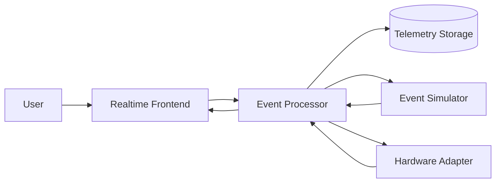

# System Context

```mermaid
flowchart LR
    user[User] --> ui[Realtime Frontend]
    ui --> backend[Event Processor]
    backend --> ui
    backend --> storage[(Telemetry Storage)]
    simulator[Event Simulator] --> backend
    backend --> simulator
    hardware[Hardware Adapter] --> backend
    backend --> hardware
```

The simulator is the first device source. The hardware adapter can be added later without changing the frontend's mental model: both sources produce events and consume commands.
